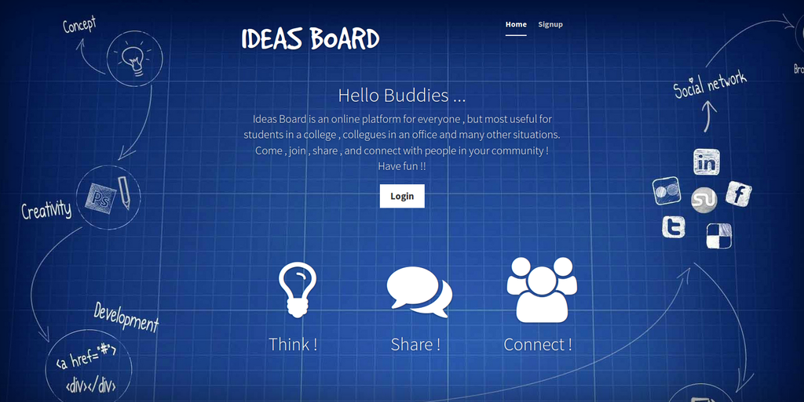
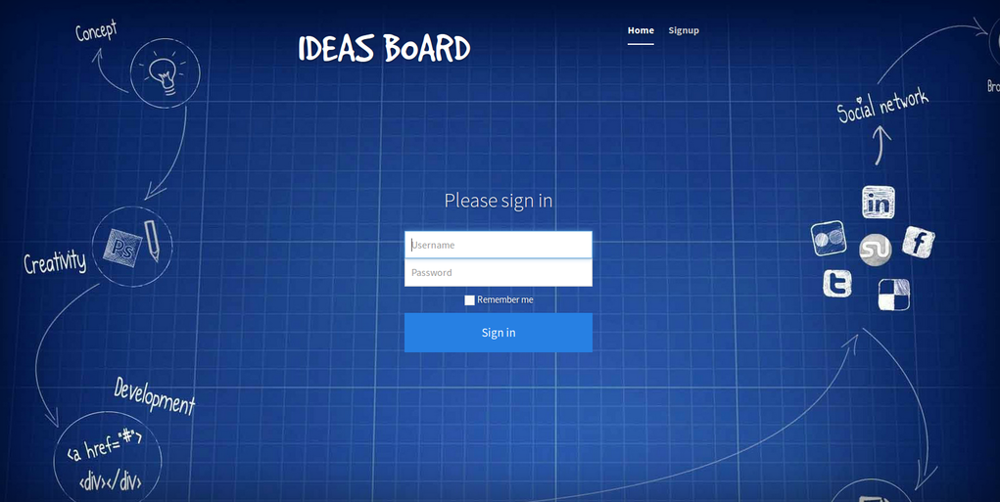
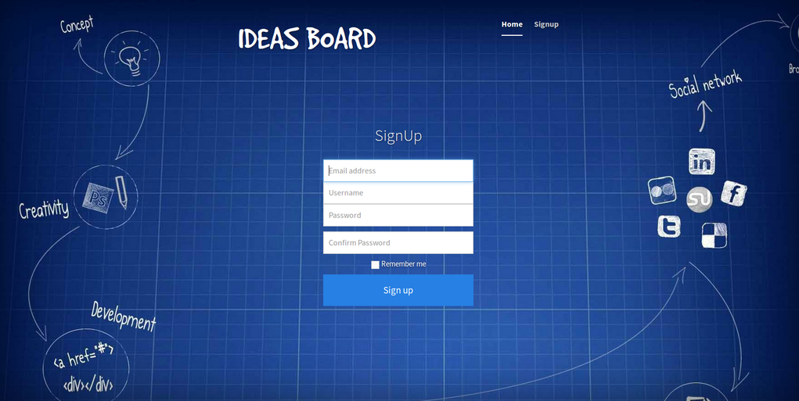
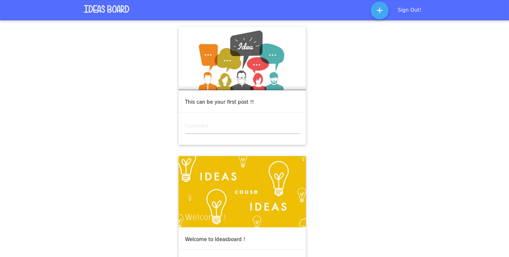
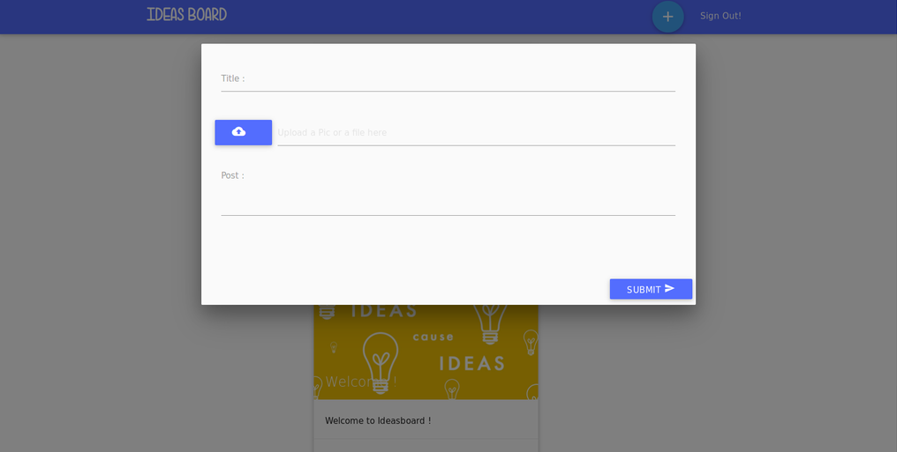

# Ideasboard
- An online notification board or pin board that can be used in classrooms, colleges and offices

- Made for closed environments i.e , schools , colleges and organizations

#Built with:
- [Bootstrap](http://getbootstrap.com/)
- [MaterializeCSS](http://materializecss.com/)
- [Font Awesome](http://fortawesome.github.io/Font-Awesome/)
- #####Backend : PHP

#Snapshots:
##Home Page:

##Login Page:

##Registration Page:

##Dashboard:

##Posting a card:

